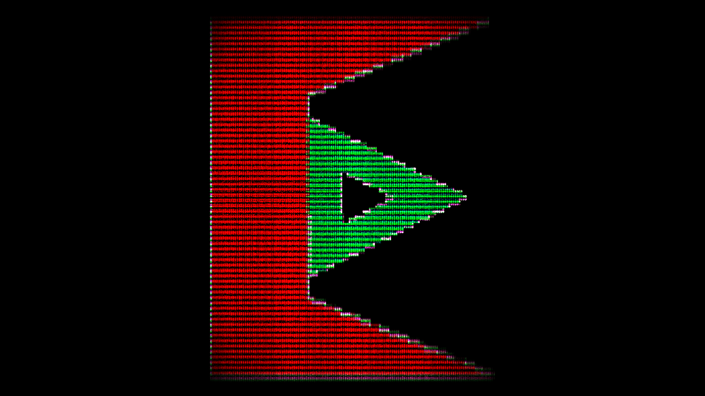

# MyScreensaver
My own Windows screensaver!

Thank you to Lucian Wischik for posting a minimal screensaver! It's the base of my screensaver! https://www.wischik.com/scr/howtoscr.html

(It moves. Glitches on purpose)

# For developers
Compile it with Visual Studio 2005 (or some other version that supports the project. I've only tested on VS 2005 so far).

# License
This project is licensed under Apache 2.0 License -  [http://www.apache.org/licenses/LICENSE-2.0](http://www.apache.org/licenses/LICENSE-2.0).
